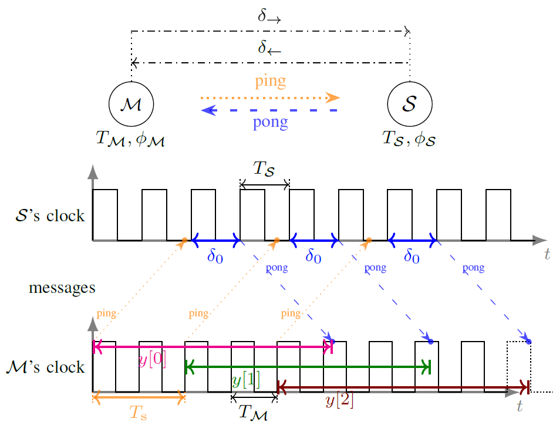

# Clock synchronization over networks — Identifiability of the sawtooth model

This GitHub repository contains the code and explanations that complement the paper "Clock synchronization over networks — Identifiability of the sawtooth model".
### Pol del Aguila Pla [[1]](https://poldap.github.io/#/), Lissy Pellaco [[2]](https://www.kth.se/profile/pellaco), Satyam Dwivedi [[3]](https://www.researchgate.net/profile/Satyam_Dwivedi2), Peter Händel [[4]](https://www.kth.se/profile/ph/) and Joakim Jaldén [[5]](https://www.kth.se/profile/jalden/)

[[1]](https://poldap.github.io/#/): Pol del Aguila Pla's research website 
[[2]](https://www.kth.se/profile/pellaco): Lissy Pellaco's research profile at KTH 
[[3]](https://www.researchgate.net/profile/Satyam_Dwivedi2): Satyam Dwivedi's researchgate profile 
[[4]](https://www.kth.se/profile/ph/): Peter Händel's research profile at KTH 
[[5]](https://www.kth.se/profile/jalden/): Joakim Jaldén's research profile at KTH 

In this repository you can find the code used to implement the different estimation strategies in our paper (#references), i.e., Periodogram and Correlation Peaks (PCP), Local/Global Grid Search (LGS/GGS), and used to produce all the plots in #ourpaper. You can also find the code used to simulate an ideal physical system with two node exchanging pulses according to the protocol described in Section II-A in our paper (#ourpaper) and in the Fig. 1.

## Computation Environment
In order to run our code successfully and in a moderate time, you will need access to a powerful computer. For reference, all our experiments have been run on a computer equipped with Intel(R) Xeon (R) CPU E5-2630 v4 @ 2.20GHz and 32 GB of RAM. In case you do not have access to a powerful CPU, we recommend skipping the intensive-to-compute plots and we suggest to directly load the data to generate the plots from *.npz, as set by default in all the notebooks. This will simply re-render the plots in the user-selected format, loading the results that were run on our computational set-up. Conversely, to run the code locally and reproduce our results, change the flags that you will find in each computation section to "True".

## Explaining code 
The simplest way to read through the annotated code is to open the relevant *.ipynb 'notebook' files through [nbviewer.jupyter.org](https://nbviewer.jupyter.org/github/poldap/SpotNet/tree/master/) You can use [nbviewer.jupyter.org](https://nbviewer.jupyter.org/github/poldap/SpotNet/tree/master/) from any modern browser, without any further installation requirements. Note that this option only allows you to visualize the notebooks, and it is not possible to execute the code or reproduce the results from the paper in this manner.

## Executing the code
If you would like to execute the code on your own computation environment and fully replicate our results, the software requirements are:

    Python 3 (for reference, we used python 3.5.2), along with the scientific computing packages numpy, operator, numba, math, time, tabulate, matplotlib, and matplotlib2tikz.
    Jupyter (for reference, we used jupyter 5.2.2), and
    TensorFlow (for reference, we used tensorflow 1.11.0).

To execute our code, you will need to be familiar with Jupyter notebooks running Python code. For that, you can refer to any of the several freely available tutorials, like [this one](https://codingthesmartway.com/getting-started-with-jupyter-notebook-for-python/). After installation of the required packages, navigate to the folder where this repository has been cloned and execute jupyter notebook to launch the Jupyter notebook server ihttps://codingthesmartway.com/getting-started-with-jupyter-notebook-for-python/n that folder. Then, a simple click to any of the *.ipynb files listed in the Jupyter notebook website loads it on a new tab, where controls for running our code are available. 

In the following, we go through the different notebooks included and explain what each of them contains. **YOU DO NOT NEED TO RUN THE JUPYTER NOTEBOOKS IN A SPECIFIC ORDER**. Each notebook automatically imports all the required dependencies. In particular, if you are interested in the numerical results, i.e. plots in our papaer we suggest to directly look at empirical_results.ipynb. If you are interested in the set-up used to simulate an ideal physical system of two nodes that operate following the protocol described in Fig.1. and Section II. A of (ourpaper), look at  Simulated nodes.ipynb.

### Imports and library of basic functions.ipynb
In this notebook we provide the basic imports and self-defined functions needed for the implementation of the different concepts and results considered in our paper [[1]](#ourpaper).

### estimation_strategies_with_examples.ipynb
In this notebook we implement our reference estimation strategies: (see Section IV.B of our paper [[1]] (#ourpaper)) and showcase them by simple examples.

### Cramér-Rao lower bounds and Monte Carlo experiments.ipynb
In this we implement 1) the computation of the CRLBs for an unwrapped model (see Section IV.A of our paper [1]), and 2) the basic machinery to run Monte Carlo experiments with our proposed estimation approaches (see Section IV.B of our paper [[1]](#ourpaper) and [estimation_strategies.ipynb](#estimation-strategies.ipynb) for their implementation) with respect to the different parameters of interest in the clock synchronization and ranging problem. 

### empirical_results.ipynb
This notebook complements Section V: Numerical results of our paper [[1]](#ourpaper). Here, we implement the experiments that yield the numerical results we report in Section V.

## Simulated nodes.ipynb
In this notebook an ideal physical system is simulated according to the protocol described in Fig.1 and in Section II-A of (). 

## Real parameters for simluated nodes.ipynb (to be deleted)

## References
[[1]](#ourpaper): Pol del Aguila Pla, Lissy Pellaco, Satyam Dwivedi, Peter Händel and Joakim Jaldén, "Clock synchronization over networks — Identifiability of the sawtooth model", Preprint, submitted to IEEE Transactions on Automatic Control, 2019.
